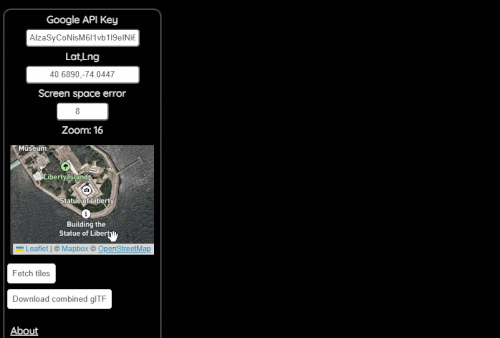

# Google Earth as glTF models

A little web app to demonstrate (1) how to fetch 3D Tiles from the [Google Photorealistic API](https://developers.google.com/maps/documentation/tile/3d-tiles) and (2) how to correctly normalize & rotate the glTF tiles, or combine a set of them into one glTF that can be rendered in any standard engine. 

### How it works

- `src/index.js` uses [loaders.gl](https://loaders.gl/) to take a given lat/lng/zoom level, traverse the tileset and return a list of URLs to glTF tiles
- `src/Viewer.js` takes these URLs, fetches them, normalizes the tiles from ECEF to centered around (0, 0, 0)

See [simple-node-example/](simple-node-example) for a minimal example of just fetching tiles for a given region, which all the extra logic the app does around filtering for tiles that match the requested screen space error.

### What is "screen space error"?

Think of it as roughly meaning "level of detail". The lowest possible SSE is 1 which is the highest quality. When you're zoomed out a lot you want to load higher SSE to get bigger tiles that cover a wider area (but that are lower quality).

Screen space error is a concept defined in the 3D Tiles specification, see: https://github.com/CesiumGS/3d-tiles/tree/main/specification#geometric-error

### Running it locally

- `npm install`
- `npm run dev`
